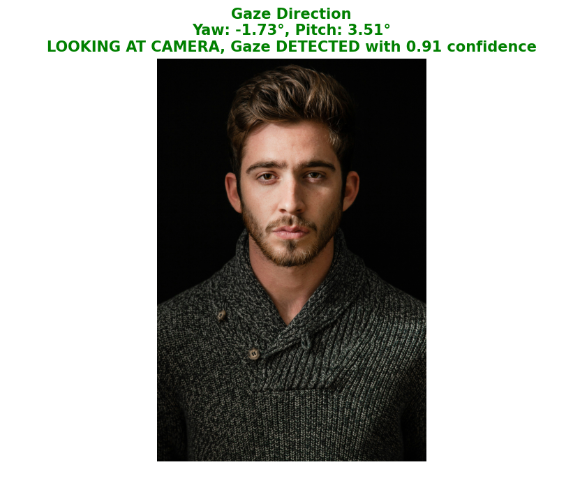
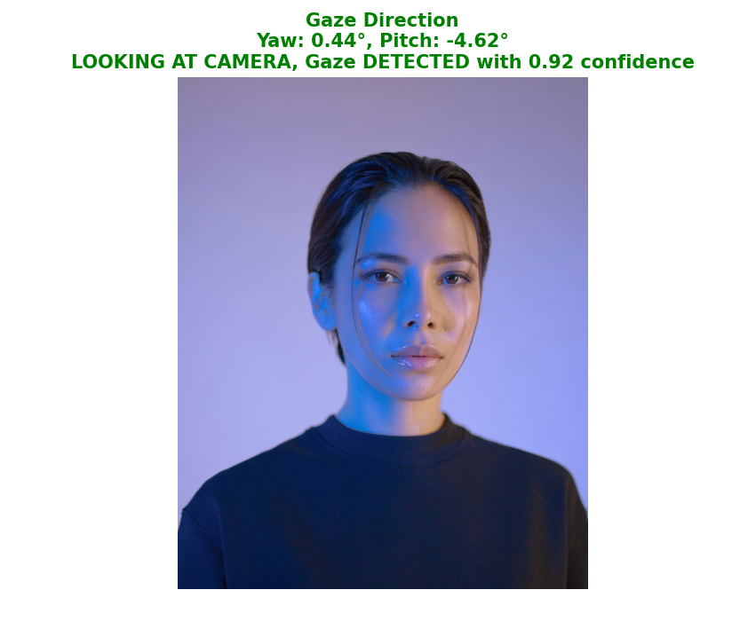
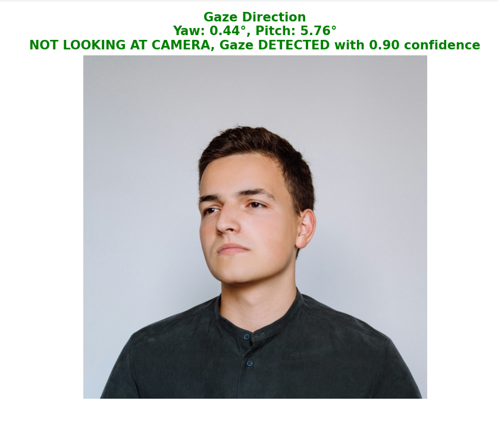
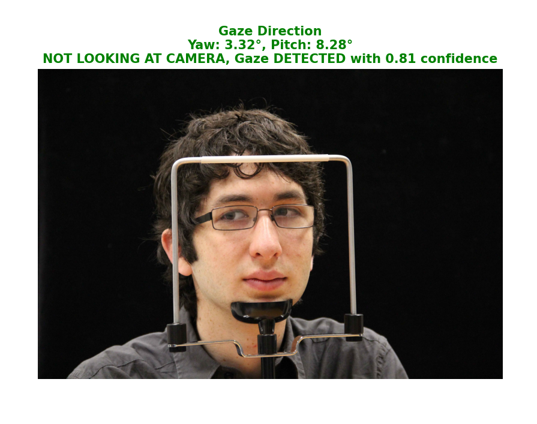

#  Gaze Detection

Gaze-Detection is an advanced deep learning project designed to predict human gaze direction by estimating yaw (horizontal) and pitch (vertical) angles from facial images. Built using TensorFlow, the state-of-the-art EfficientNetV2S convolutional neural network, and a custom attention mechanism, this project achieves precise gaze estimation with up to 40% improvement over baseline performance. It includes robust confidence scoring and intuitive visualizations, making it a powerful tool for real-world applications such as driver monitoring systems to detect distraction, human-computer interaction for accessibility, and market research to analyze user attention and engagement.

---

##  Project Overview

Gaze-Detection leverages EfficientNetV2S with a custom attention layer to predict head orientation (yaw and pitch) from facial images.  
It outputs gaze angles, confidence scores, and determines if the person is looking at the camera, achieving up to **40% improvement** over baseline performance.

###  Key Features

- **Accurate Gaze Prediction**: Estimates yaw (horizontal) and pitch (vertical) angles with high precision.  
- **Custom Attention Layer**: Enhances focus on critical facial features.  
- **Confidence Scoring**: Provides prediction reliability.  
- **Visualization**: Displays results with images and gaze status (e.g., *"LOOKING AT CAMERA"*).  
- **Applications**: Driver distraction detection, accessibility tools, user attention analysis.

---

## 📁 Folder Structure

```
├── test.py              # Predicts gaze direction and visualizes results
├── training.py          # Trains the model and generates .keras file
├── requirements.txt     # Required Python packages
└── screenshots/         # Demo visuals (looking_*.png, not_looking_*.png)
```

---

##  Getting Started

###  Prerequisites

- **Python**: 3.8+
- **Dependencies**: `tensorflow`, `opencv-python`, `numpy`, `matplotlib`, `dlib` *(optional for face detection)*  
- **Dataset**: Columbia Gaze Dataset  
  - Source: Columbia University Computer Vision Lab  
  - Description: Contains facial images with annotated yaw and pitch angles  
  - [Download the dataset here](https://www.cs.columbia.edu/CAVE/databases/columbia_gaze/)
- **Hardware**: GPU recommended for training

---

###  Installation

### 1. Clone the repository:

```bash
git clone https://github.com/AbdullahShariq/Gaze-Detection.git
cd Gaze-Detection
```
### 2. Install dependencies
```bash
pip install -r requirements.txt
```
### 3. Run training to generate the model
```bash
python training.py
```
This will create `gaze_detection_model.keras` in your project root.

---


##  Usage

###  Inference (Predict Gaze)

Ensure `gaze_detection_model.keras` is present in the root directory.  
Run the following command to predict gaze direction:

```bash
python test.py
```
Example Input: NL4.jpg

Output: Displays the image with predicted status (e.g., "LOOKING AT CAMERA")

---

##  Example Outputs

###  Looking at Camera
<p align="center">
  
  
</p>
<p align="center">
  <em>Figure: Person detected as looking at the camera</em>
</p>

###  Not Looking at Camera
<p align="center">
  
  
</p>
<p align="center">
  <em>Figure: Person detected as not looking at the camera</em>
</p>

---

##  Results

- **Yaw MAE**: ~5.0°
- **Pitch MAE**: ~6.0°
- **Angular MAE**: ~7.5°
- Up to **40% improvement** in yaw error over baseline.

---

##  Technologies Used

- **Python**: Core language  
- **TensorFlow**: Deep learning framework  
- **EfficientNetV2S**: CNN backbone  
- **OpenCV**: Image processing  
- **Matplotlib**: Visualization
